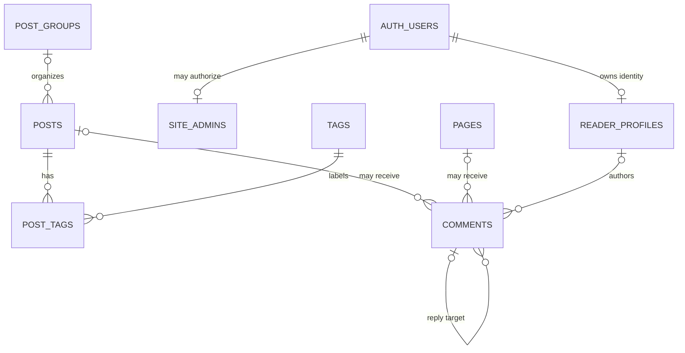

# Database Design

This document captures the agreed first-release database design for Sleepy. It is a design reference, not an executable migration.

## Scope

The database supports:

- one Admin;
- regular posts and heartworks stored as variants of the same Post model;
- code-defined Pages backed by independently editable Markdown;
- reusable Post Groups and flat Tags;
- GitHub-authenticated readers and two-level comment threads;
- public, draft, published, archived, and comment-moderation access rules enforced with RLS.

The domain vocabulary is defined in [`CONTEXT.md`](../CONTEXT.md). Relevant architectural decisions are:

- [`ADR-0001`](./adr/0001-store-pages-separately-from-posts.md): store Pages separately from Posts;
- [`ADR-0002`](./adr/0002-validate-comment-shape-in-application-code.md): validate Comment shape in application code;
- [`ADR-0003`](./adr/0003-use-exclusive-arc-for-comment-targets.md): use exclusive foreign-key columns for Comment targets.

## Conventions

- Use lowercase SQL identifiers.
- Use `bigint generated always as identity` for internal application primary keys.
- Use UUID only where an identifier must match `auth.users.id`.
- Use `text` rather than artificial `varchar(n)` limits.
- Use `timestamptz` for every timestamp.
- Use `text` plus `CHECK` for Post kinds and statuses instead of PostgreSQL enums.
- Use a shared `set_updated_at()` trigger for tables with `updated_at`.
- Public URLs use Slugs or Page Keys; internal numeric IDs are not exposed as public identity.

## Schemas

### `public`

- `posts`
- `pages`
- `post_groups`
- `tags`
- `post_tags`
- `reader_profiles`
- `comments`

### `private`

- `site_admins`
- `is_admin()`

The `private` schema is not exposed through the Supabase Data API.

## Entity relationship diagram



A Comment belongs to exactly one Post or one Page. A table-level `CHECK` constraint enforces this exclusive-target rule. Per ADR-0003, targets are referenced through per-type foreign-key columns rather than a polymorphic type-and-id pair.

## Tables

### `private.site_admins`

The allowlist that distinguishes the single site Admin from ordinary GitHub-authenticated readers.

| Column | Type | Rules |
| --- | --- | --- |
| `user_id` | `uuid` | Primary key; foreign key to `auth.users(id)` with `ON DELETE CASCADE` |
| `created_at` | `timestamptz` | Not null; defaults to `now()` |

There are no roles, permission arrays, GitHub usernames, or profile fields in this table. The first Admin account is added manually after its initial GitHub login.
The table has a unique constant-expression index so that it can contain at most one row.

### `reader_profiles`

Public display information for GitHub-authenticated readers.

| Column | Type | Rules |
| --- | --- | --- |
| `id` | `uuid` | Primary key; foreign key to `auth.users(id)` with `ON DELETE CASCADE` |
| `github_username` | `text` | Display data; not used as identity or authorization |
| `display_name` | `text` | Nullable |
| `avatar_url` | `text` | Nullable |
| `profile_url` | `text` | Nullable |
| `commenting_blocked_at` | `timestamptz` | Nullable; non-null prevents new Comments |
| `created_at` | `timestamptz` | Not null; defaults to `now()` |
| `updated_at` | `timestamptz` | Not null; defaults to `now()` and is maintained automatically |

The stable identity is `id`; `github_username` is not unique because GitHub usernames can change or be reassigned. Application code creates or refreshes the profile after GitHub login. No `auth.users` trigger is used.

Deleting a Reader Profile does not delete its Comments. The corresponding `comments.author_id` values become null and are presented as an account that no longer exists.

### `post_groups`

The shared persistence model for Categories and Columns. A Regular Post group is presented as a Category; a Heartwork group is presented as a Column.

| Column | Type | Rules |
| --- | --- | --- |
| `id` | `bigint` | Identity primary key |
| `kind` | `text` | Not null; one of `regular`, `heartwork` |
| `name` | `text` | Not null |
| `slug` | `text` | Not null |
| `description` | `text` | Nullable |
| `created_at` | `timestamptz` | Not null; defaults to `now()` |
| `updated_at` | `timestamptz` | Not null; defaults to `now()` and is maintained automatically |

Constraints and indexes:

- unique `(id, kind)`, used as the composite foreign-key target from Posts;
- unique `(kind, slug)`;
- unique index on `(kind, lower(name))`;
- `slug` matches `^[a-z0-9]+(-[a-z0-9]+)*$` and remains stable after creation.

A referenced Post Group cannot be deleted. The Admin must first move all Posts to another group with the same kind. Empty groups can be deleted; groups do not have an inactive state.

### `posts`

Regular Posts and Heartworks share one table because all fields and lifecycle rules are identical. `kind` is the only structural discriminator.

| Column | Type | Rules |
| --- | --- | --- |
| `id` | `bigint` | Identity primary key |
| `kind` | `text` | Not null; one of `regular`, `heartwork` |
| `group_id` | `bigint` | Nullable for incomplete Drafts |
| `title` | `text` | Nullable for incomplete Drafts |
| `slug` | `text` | Nullable for incomplete Drafts; globally unique when present; lowercase ASCII kebab-case |
| `summary` | `text` | Nullable and optional in every state |
| `body_markdown` | `text` | Not null; defaults to the empty string |
| `status` | `text` | Not null; defaults to `draft`; one of `draft`, `published`, `archived` |
| `comments_enabled` | `boolean` | Not null; defaults to `true` |
| `created_at` | `timestamptz` | Not null; defaults to `now()` |
| `updated_at` | `timestamptz` | Not null; defaults to `now()` and is maintained automatically |
| `published_at` | `timestamptz` | Nullable until first publication |
| `archived_at` | `timestamptz` | Required only while Archived |
| `archive_note` | `text` | Nullable; allowed only while Archived |

Foreign keys and uniqueness:

- `(group_id, kind)` references `post_groups(id, kind)` with deletion restricted;
- `slug` is globally unique across Regular Posts and Heartworks.

Database checks:

- `kind` belongs to its allowed set;
- `kind` cannot change after creation;
- `status` belongs to its allowed set;
- a non-null Slug matches `^[a-z0-9]+(-[a-z0-9]+)*$`;
- Published and Archived Posts have a non-blank title, non-blank Slug, non-blank Markdown body, and a Post Group;
- Published and Archived Posts have `published_at`;
- Archived Posts have `archived_at` and may have `archive_note`;
- non-Archived Posts have neither `archived_at` nor `archive_note`.

Application-maintained invariants:

- the Slug cannot change after first publication;
- updates compare the Admin editor's previously observed `updated_at` value and reject stale writes;
- `published_at` records first publication and survives withdrawal to Draft and later republication;
- publishing modifies the current record directly; there is no separately persisted revision draft;
- restoring or withdrawing an Archived Post clears `archived_at` and `archive_note`.

Lifecycle:

```text
Draft ──publish──> Published ──archive──> Archived
  ↑                    │                    │
  └────withdraw────────┘──────restore──────┘
```

Archived Posts remain publicly readable at their original URL and carry an archive notice. Hard deletion removes the Post, its Comments, and its Tag relationships.

Indexes:

- unique index on `slug`;
- `(kind, status, published_at desc, id desc)`;
- `(group_id, kind, status, published_at desc, id desc)`.

### `pages`

A Page is code-defined presentation and behavior backed by one independently editable Markdown record. Creating a record does not create a route; a frontend route reads it by Page Key.

| Column | Type | Rules |
| --- | --- | --- |
| `id` | `bigint` | Identity primary key |
| `page_key` | `text` | Not null; unique; immutable application contract |
| `body_markdown` | `text` | Not null; defaults to the empty string |
| `comments_enabled` | `boolean` | Not null; defaults to `false` |
| `created_at` | `timestamptz` | Not null; defaults to `now()` |
| `updated_at` | `timestamptz` | Not null; defaults to `now()` and is maintained automatically |

`page_key` must match `^[a-z0-9]+(-[a-z0-9]+)*$`.

Pages deliberately have no publication status, title, summary, Slug, Post Group, Tags, or archive metadata. A record with empty Markdown is valid and publicly readable when a route exists. A route whose Page Key does not exist returns 404. Deleting a Page record causes its route to return 404 and cascades to its Comments.

Page routes, layout, headings, SEO metadata, and whether the Comment UI is rendered remain in application code. `comments_enabled` is the database authorization switch that prevents direct comment insertion when Comments are disabled.

### `tags`

Flat, reusable, optional labels shared by Regular Posts and Heartworks.

| Column | Type | Rules |
| --- | --- | --- |
| `id` | `bigint` | Identity primary key |
| `name` | `text` | Not null; case-insensitively unique |
| `slug` | `text` | Not null; globally unique and stable |
| `created_at` | `timestamptz` | Not null; defaults to `now()` |
| `updated_at` | `timestamptz` | Not null; defaults to `now()` and is maintained automatically |

Constraints and indexes:

- unique `slug`;
- unique index on `lower(name)`;
- `slug` matches `^[a-z0-9]+(-[a-z0-9]+)*$` and remains stable after creation.

Tags are not hierarchical. They may be created from the Post editor or a dedicated management screen. Deleting a Tag removes its Post relationships but does not delete Posts.

### `post_tags`

The many-to-many relationship between Posts and Tags.

| Column | Type | Rules |
| --- | --- | --- |
| `post_id` | `bigint` | Foreign key to `posts(id)` with `ON DELETE CASCADE` |
| `tag_id` | `bigint` | Foreign key to `tags(id)` with `ON DELETE CASCADE` |

The composite primary key is `(post_id, tag_id)`. There is no surrogate `id`. An additional index on `tag_id` supports Tag-to-Post lookups and foreign-key operations.

### `comments`

GitHub-authenticated reader responses attached to either a Post or a Page.

| Column | Type | Rules |
| --- | --- | --- |
| `id` | `bigint` | Identity primary key |
| `post_id` | `bigint` | Nullable foreign key to `posts(id)` with `ON DELETE CASCADE` |
| `page_id` | `bigint` | Nullable foreign key to `pages(id)` with `ON DELETE CASCADE` |
| `author_id` | `uuid` | Nullable foreign key to `reader_profiles(id)` with `ON DELETE SET NULL` |
| `root_id` | `bigint` | Nullable self-reference to `comments(id)` |
| `reply_to_id` | `bigint` | Nullable self-reference to `comments(id)` |
| `body` | `text` | Not null; defaults to the empty string |
| `deleted_at` | `timestamptz` | Nullable |
| `created_at` | `timestamptz` | Not null; defaults to `now()` |

The table has no `updated_at` because Comment bodies cannot be edited.

Database checks:

- exactly one of `post_id` and `page_id` is non-null;
- `char_length(body)` does not exceed 10000.

These two invariants are enforced in the database because authenticated readers can insert Comments directly through the Data API under RLS, bypassing application validation. Reply shape, same-thread addressing, and soft-deletion form remain application-maintained, as recorded in ADR-0002; violating them degrades presentation rather than corrupting target relationships.

Application behavior:

- a top-level Comment has neither `root_id` nor `reply_to_id`;
- a reply stores the top-level Comment in `root_id` and the specific addressed Comment in `reply_to_id`;
- any reply in the same thread can be addressed, while presentation remains two levels deep;
- deleting a Comment clears `body`, sets `deleted_at`, and retains the row as a discussion placeholder;
- closing Comments retains all rows, hides the whole section, and prevents new insertion;
- a blocked Reader cannot add Comments;
- future Moments may add `moment_id`; no generic comment-target abstraction is created in the first release.

Indexes:

- `(post_id, root_id, created_at desc, id desc)`;
- `(page_id, root_id, created_at desc, id desc)`;
- `(root_id, created_at, id)`;
- index on `reply_to_id`;
- index on `author_id`.

Top-level threads are paginated by `(created_at, id)`. A page of top-level Comments includes all replies belonging to those roots.

## Row-level security

All exposed `public` tables have RLS enabled. Application validation improves user feedback; RLS remains the final authorization layer for requests that bypass the application UI.

### Public and authenticated reads

| Table | Policy |
| --- | --- |
| `posts` | Anonymous and authenticated readers can select Published and Archived rows; the Admin can select all rows |
| `pages` | Publicly selectable |
| `post_groups` | Publicly selectable |
| `tags` | Publicly selectable |
| `post_tags` | Publicly selectable |
| `comments` | Publicly selectable only when the target Post or Page has Comments enabled and the Post, when applicable, is public |
| `reader_profiles` | Public display fields are selectable |
| `private.site_admins` | Not publicly selectable or exposed |

Public column privileges or a public projection expose only profile display fields; `commenting_blocked_at` is not part of the reader-facing profile shape.

### Content writes

Only a user for whom `private.is_admin()` returns true can insert, update, or delete:

- Posts;
- Pages;
- Post Groups;
- Tags;
- Post-Tag relationships.

The administrator also manages all Comments and reader commenting blocks.

### Comment writes

An authenticated reader may insert a Comment only when:

- `author_id = auth.uid()`;
- the Reader is not blocked;
- the target exists, is public when applicable, and has Comments enabled.

Thread shape is validated by application code; target exclusivity and body length are enforced by table `CHECK` constraints because inserts can reach the Data API directly. RLS still ensures that an insertion is authorized for a valid, comment-enabled target.

A reader may update only `body` and `deleted_at` on their own Comment, and only to perform the accepted soft-delete operation. They cannot change author, target, root, or reply relationships. Ordinary readers cannot physically delete Comment rows.

### `private.is_admin()`

The helper checks the current `auth.uid()` against `private.site_admins`. If implemented as `SECURITY DEFINER`, it must:

- live outside exposed schemas;
- use an empty, explicit search path and fully qualified object names;
- read `auth.uid()` internally rather than accepting a caller-supplied user ID;
- revoke execution from `PUBLIC` and anonymous callers;
- grant only the execution needed by authenticated policies.

GitHub usernames, email addresses, profile fields, and `user_metadata` never determine administrator authorization.

An authenticated-only `public.is_admin()` RPC delegates to `private.is_admin()` and returns only the boolean decision needed by the server-rendered Studio shell. It exposes neither the allowlist nor the Admin's user ID.

## Automatic database behavior

The only business-table trigger is a shared `set_updated_at()` trigger on:

- `posts`;
- `pages`;
- `post_groups`;
- `tags`;
- `reader_profiles`.

There are no Comment validation triggers, Auth-to-Profile triggers, custom comment RPCs, scheduled jobs, or revision-history triggers.

## Explicitly deferred or excluded

The first release does not design or store:

- full-text search columns, indexes, or extensions;
- RSS subscriptions or email subscribers;
- scheduled publication;
- persisted revisions or a separate server draft beside a published record;
- multiple Admins, tenants, or RBAC;
- Likes, favorites, or other reader interactions;
- short-form Moments;
- media assets or upload relationships—Markdown references third-party image hosting or OSS URLs;
- Page Tags, Page publication state, or database-controlled Page routing and layout;
- Markdown front matter as database state;
- comment rendering format.

These capabilities can be introduced through future migrations when their requirements are concrete.
