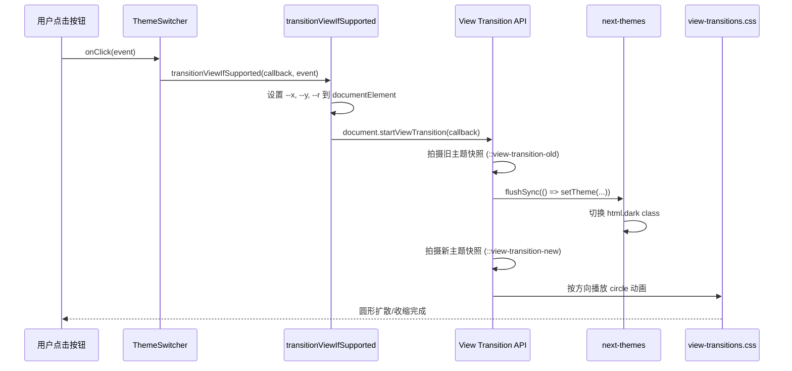

# 主题切换圆形展开动画 — 实现调研与复刻指南

> 本文档描述 sleepy-blog 项目中「黑夜/白天模式切换」时，从点击位置向外扩散（或向内收缩）的圆形过渡动画的完整实现思路，供其他 AI 或开发者独立复刻。

---

## 1. 效果概述

用户点击页面顶部的主题切换按钮后：

- **切换到暗色模式**：一个圆形从**点击位置**开始，向外扩散，暗色主题逐渐覆盖全屏。
- **切换到亮色模式**：当前暗色画面以圆形方式**向点击位置收缩**，露出下方的亮色主题。
- 圆心始终是用户点击的坐标，半径足够大以覆盖整个视口。

该效果**不是**用 Canvas、SVG 或 Framer Motion 手动画圆，而是基于浏览器原生的 **View Transition API**，配合 **CSS `clip-path: circle()`** 实现。

---

## 2. 核心技术栈

| 技术 | 作用 |
|------|------|
| [View Transition API](https://developer.mozilla.org/en-US/docs/Web/API/View_Transitions_API) | 在 DOM 更新前后各拍一张「快照」，用伪元素做过渡动画 |
| CSS `clip-path: circle()` | 用圆形裁剪区域，实现扩散/收缩视觉效果 |
| [next-themes](https://github.com/pacocoursey/next-themes) | 管理主题状态，在 `<html>` 上切换 `class="dark"` |
| React `flushSync` | 强制同步提交 DOM 更新，确保 View Transition 能捕获到新状态 |
| CSS 自定义属性 `--x` / `--y` / `--r` | 传递点击坐标与最大半径给 CSS 动画 |

---

## 3. 整体架构



### 数据流简述

1. **点击** → 拿到 `clientX` / `clientY`。
2. **计算半径** → 从点击点到屏幕四角的最远距离，保证圆能盖住整个屏幕。
3. **启动过渡** → `startViewTransition` 包裹真正的主题切换逻辑。
4. **同步更新** → `flushSync + setTheme` 让 `<html>` 的 class 立即变化。
5. **CSS 动画** → 浏览器提供的 `::view-transition-old(root)` / `::view-transition-new(root)` 伪元素执行 `clip-path` 动画。

---

## 4. 本仓库文件清单

| 文件 | 职责 |
|------|------|
| `src/utils/dom.ts` | 封装 `transitionViewIfSupported`，处理降级与坐标计算 |
| `src/styles/view-transitions.css` | 定义圆形扩散/收缩动画 |
| `src/components/ThemeSwitcher/index.tsx` | 主题切换 UI，调用过渡函数 |
| `src/providers/RootProvider/index.tsx` | 挂载 `next-themes` 的 `ThemeProvider` |
| `src/app/layout.tsx` | 全局引入 `view-transitions.css` |
| `src/app/globals.css` | 定义 `:root` / `.dark` 下的 CSS 变量（颜色 token） |

> 注意：Dashboard 里的 `ThemeToggle`（`src/app/(dashboard)/_components/layout/DashboardLayout.tsx`）**没有**使用该动画，仅公共站点的 `ThemeSwitcher` 有圆形过渡。

---

## 5. 分步复刻指南

以下代码可直接用于任意 React / Next.js 项目，不依赖本仓库其他模块。

### 5.1 安装依赖

```bash
npm install next-themes
```

### 5.2 配置主题 Provider

在根布局外包一层 `ThemeProvider`，通过 `class` 策略切换暗色模式：

```tsx
// providers/ThemeProvider.tsx
"use client";

import { ThemeProvider as NextThemesProvider } from "next-themes";

export function ThemeProvider({ children }: { children: React.ReactNode }) {
  return (
    <NextThemesProvider attribute="class" enableSystem enableColorScheme defaultTheme="system">
      {children}
    </NextThemesProvider>
  );
}
```

```tsx
// app/layout.tsx
import { ThemeProvider } from "@/providers/ThemeProvider";
import "./globals.css";
import "@/styles/view-transitions.css";

export default function RootLayout({ children }: { children: React.ReactNode }) {
  return (
    <html lang="zh-CN" suppressHydrationWarning>
      <body suppressHydrationWarning>
        <ThemeProvider>{children}</ThemeProvider>
      </body>
    </html>
  );
}
```

`suppressHydrationWarning` 用于避免 next-themes 在客户端注水时与 SSR 的 class 不一致产生警告。

### 5.3 定义主题颜色变量

动画背景使用 `rgb(var(--color-background))`，因此需要亮/暗两套 CSS 变量：

```css
/* globals.css */
:root {
  --color-background: 248 250 252; /* 亮色背景，空格分隔的 RGB 分量 */
  color-scheme: light;
}

.dark {
  --color-background: 17 24 39; /* 暗色背景 */
  color-scheme: dark;
}

body {
  background-color: rgb(var(--color-background));
}
```

Tailwind 项目可额外设置 `darkMode: "selector"`，与 `class="dark"` 策略一致。

### 5.4 编写过渡工具函数

```typescript
// utils/dom.ts
export const transitionViewIfSupported = (
  updateCb: () => void,
  clickEvent?: MouseEvent | React.MouseEvent,
) => {
  // 尊重系统「减少动画」偏好
  if (window.matchMedia("(prefers-reduced-motion: reduce)").matches) {
    updateCb();
    return;
  }

  if (!document.startViewTransition) {
    updateCb();
    return;
  }

  if (clickEvent) {
    const x = clickEvent.clientX;
    const y = clickEvent.clientY;
    const endRadius = Math.hypot(
      Math.max(x, window.innerWidth - x),
      Math.max(y, window.innerHeight - y),
    );

    document.documentElement.style.setProperty("--x", `${x}px`);
    document.documentElement.style.setProperty("--y", `${y}px`);
    document.documentElement.style.setProperty("--r", `${endRadius}px`);
  }

  document.startViewTransition(updateCb);
};
```

**关键点：**

- `Math.hypot` 计算覆盖全屏所需的最小圆半径。
- 变量写在 `document.documentElement`（即 `<html>`）上，供全局 CSS 读取。
- 不支持 API 或用户禁用动画时，直接执行回调，功能不受影响。

### 5.5 编写圆形动画 CSS

```css
/* styles/view-transitions.css */

/* 关闭浏览器默认的 cross-fade，改为自定义圆形动画 */
::view-transition-old(root),
::view-transition-new(root) {
  animation: none;
  mix-blend-mode: normal;
}

::view-transition-new(root) {
  background: rgb(var(--color-background));
  z-index: 1;
}

/* 默认（切换到亮色）：旧画面（暗色）向圆心收缩 */
::view-transition-old(root) {
  clip-path: circle(var(--r, 100vmax) at var(--x, 50%) var(--y, 50%));
  animation: theme-shrink-light 0.7s ease-out forwards;
  z-index: 2;
}

/* 切换到暗色：新画面（暗色）从圆心向外扩散 */
.dark::view-transition-old(root) {
  animation: none;
  z-index: -1;
}

.dark::view-transition-new(root) {
  clip-path: circle(0 at var(--x, 50%) var(--y, 50%));
  animation: theme-expand-dark 0.7s ease-out forwards;
  background: rgb(var(--color-background));
  z-index: 1;
}

@keyframes theme-shrink-light {
  from {
    clip-path: circle(var(--r, 100vmax) at var(--x, 50%) var(--y, 50%));
  }
  to {
    clip-path: circle(0 at var(--x, 50%) var(--y, 50%));
  }
}

@keyframes theme-expand-dark {
  from {
    clip-path: circle(0 at var(--x, 50%) var(--y, 50%));
  }
  to {
    clip-path: circle(var(--r, 100vmax) at var(--x, 50%) var(--y, 50%));
  }
}
```

### 5.6 主题切换组件

```tsx
// components/ThemeSwitcher.tsx
"use client";

import { useTheme } from "next-themes";
import { flushSync } from "react-dom";
import { transitionViewIfSupported } from "@/utils/dom";

export function ThemeSwitcher() {
  const { theme, setTheme } = useTheme();

  const handleClick = (target: "light" | "dark" | "system", e: React.MouseEvent) => {
    if (theme === target) return;

    transitionViewIfSupported(() => {
      flushSync(() => setTheme(target));
    }, e);
  };

  return (
    <div>
      <button onClick={(e) => handleClick("light", e)}>亮色</button>
      <button onClick={(e) => handleClick("dark", e)}>暗色</button>
      <button onClick={(e) => handleClick("system", e)}>系统</button>
    </div>
  );
}
```

**`flushSync` 为什么必需？**

React 18+ 默认批量异步更新 DOM。`startViewTransition` 的回调里如果不同步提交，`next-themes` 对 `<html>` 的 class 修改可能发生在快照拍摄之后，导致过渡失效或闪烁。`flushSync` 保证「旧快照 → 立即改 DOM → 新快照」的时序正确。

---

## 6. 动画方向判定逻辑（重要）

CSS 用**切换完成后** `<html>` 是否带 `.dark` 来决定动画方向：

| 场景 | 切换后 `html` 是否有 `.dark` | 生效规则 | 视觉效果 |
|------|------------------------------|----------|----------|
| 亮色 → 暗色 | 有 `.dark` | `.dark::view-transition-new(root)` 的 `theme-expand-dark` | 暗色从点击处**向外扩散** |
| 暗色 → 亮色 | 无 `.dark` | 默认 `::view-transition-old(root)` 的 `theme-shrink-light` | 暗色向点击处**向内收缩** |

时序说明：

1. `startViewTransition` 先捕获**旧状态**快照。
2. 回调内 `setTheme` 修改 `<html class>`。
3. 再捕获**新状态**快照。
4. 两套快照分别对应 `::view-transition-old(root)` 与 `::view-transition-new(root)`。

因此 `.dark` 选择器绑定的是**新主题是否为暗色**，从而自然区分扩散/收缩方向。

---

## 7. 浏览器兼容与降级

| 环境 | 行为 |
|------|------|
| Chrome 111+、Edge 111+ | 完整圆形动画 |
| Safari 18+ | 支持 View Transition API |
| Firefox | 截至 2026 年初支持仍有限，走降级逻辑（瞬间切换） |
| `prefers-reduced-motion: reduce` | 跳过动画，直接切换主题 |

降级策略已内置在 `transitionViewIfSupported` 中，无需额外处理。

---

## 8. 可自定义项

| 参数 | 位置 | 说明 |
|------|------|------|
| 动画时长 | `view-transitions.css` 中 `0.7s` | 可改为 `0.5s` 等 |
| 缓动函数 | `ease-out` | 可改为 `cubic-bezier(...)` |
| 默认圆心 | `var(--x, 50%) var(--y, 50%)` | 未传点击事件时从屏幕中心扩散 |
| 默认半径 | `var(--r, 100vmax)` | 未传点击事件时的兜底半径 |
| 背景色 | `--color-background` | 应与页面主背景一致，避免过渡层色差 |

---

## 9. 常见问题排查

### 动画不生效

1. 是否全局引入了 `view-transitions.css`？
2. 是否使用了 `flushSync` 包裹 `setTheme`？
3. 是否把 `clickEvent` 传给了 `transitionViewIfSupported`？（不传则退化为从中心扩散）
4. 浏览器是否支持 `document.startViewTransition`？

### 过渡层颜色与页面不一致

确认 `--color-background` 在 `:root` 和 `.dark` 下均有定义，且与 `body` 实际背景色一致。

### 水合闪烁（Hydration mismatch）

- `<html>` / `<body>` 加 `suppressHydrationWarning`
- 主题相关 UI 在客户端 mount 后再渲染激活态（本仓库用 `useIsClient` hook）

### 切换到「system」主题时动画方向异常

`system` 会根据 OS 偏好解析为 `light` 或 `dark`，动画方向取决于解析结果。若需固定视觉效果，可改为仅在 `light` ↔ `dark` 切换时启用动画。

---

## 10. 最小可运行复刻 Checklist

```
[ ] 安装 next-themes
[ ] ThemeProvider 包裹应用（attribute="class"）
[ ] globals.css 定义 :root / .dark 的 --color-background
[ ] 创建 utils/dom.ts（transitionViewIfSupported）
[ ] 创建 styles/view-transitions.css 并在 layout 引入
[ ] 主题按钮 onClick 中调用 transitionViewIfSupported + flushSync + setTheme
[ ] 传入 React.MouseEvent 以启用点击圆心
[ ] 在 Chrome 中验证亮→暗（扩散）和暗→亮（收缩）
```

---

## 11. 参考源码（本仓库）

以下为实际生产代码，复刻时可直接对照：

**过渡工具函数** — `src/utils/dom.ts`

```typescript
export const transitionViewIfSupported = (updateCb: () => void, clickEvent?: MouseEvent | React.MouseEvent) => {
  if (window.matchMedia(`(prefers-reduced-motion: reduce)`).matches) {
    updateCb();
    return;
  }

  if (document.startViewTransition) {
    if (clickEvent) {
      const x = clickEvent.clientX;
      const y = clickEvent.clientY;
      const endRadius = Math.hypot(Math.max(x, window.innerWidth - x), Math.max(y, window.innerHeight - y));

      document.documentElement.style.setProperty("--x", `${x}px`);
      document.documentElement.style.setProperty("--y", `${y}px`);
      document.documentElement.style.setProperty("--r", `${endRadius}px`);
    }

    document.startViewTransition(updateCb);
  } else {
    updateCb();
  }
};
```

**主题切换组件** — `src/components/ThemeSwitcher/index.tsx`

```typescript
const handleThemeClick = (targetTheme: "light" | "dark" | "system", event: React.MouseEvent) => {
  if (isClient && theme === targetTheme) return;

  transitionViewIfSupported(() => {
    flushSync(() => setTheme(targetTheme));
  }, event);
};
```

**动画样式** — `src/styles/view-transitions.css`（完整内容见该文件，第 1–55 行）

---

## 12. 延伸阅读

- [MDN: View Transition API](https://developer.mozilla.org/en-US/docs/Web/API/View_Transitions_API)
- [MDN: ::view-transition-old](https://developer.mozilla.org/en-US/docs/Web/CSS/Reference/Selectors/::view-transition-old)
- [MDN: clip-path](https://developer.mozilla.org/en-US/docs/Web/CSS/Reference/Properties/clip-path)
- [next-themes 文档](https://github.com/pacocoursey/next-themes)
- [React flushSync](https://react.dev/reference/react-dom/flushSync)

---

*文档基于 sleepy-blog 仓库 `feat/v1` 分支源码整理。*